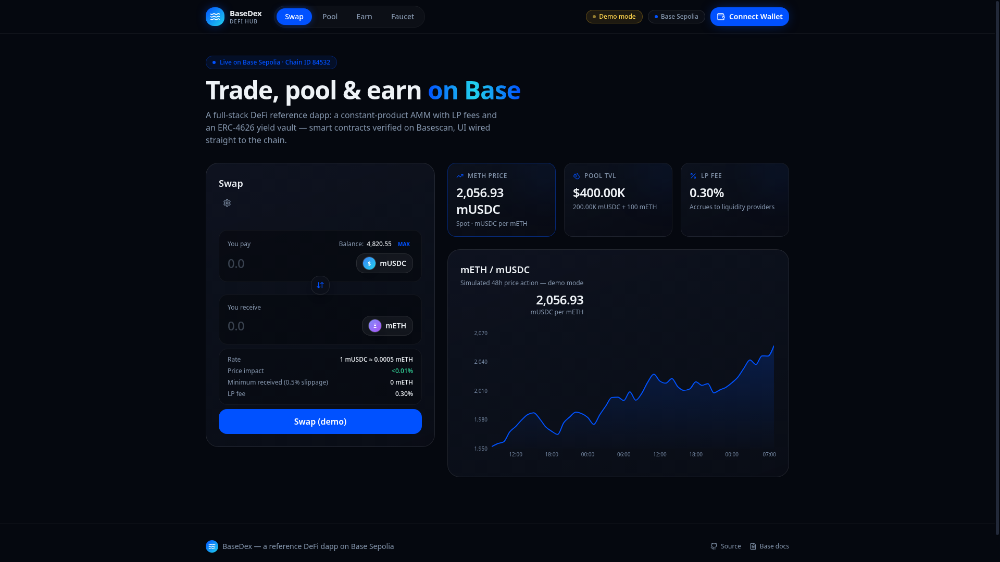

# BaseDex — DeFi Hub on Base

[](https://github.com/OWNER/REPO/actions/workflows/ci.yml)
[](https://sepolia.basescan.org)
[](https://book.getfoundry.sh)
[](https://wagmi.sh)
[](LICENSE)

A full-stack, production-grade **DeFi reference dapp on Base Sepolia**: a constant-product
AMM decentralized exchange (swap + liquidity pools, Uniswap V2 style) plus an **ERC-4626
yield vault** — Solidity contracts built and tested with Foundry, and a modern dark-mode
React frontend wired to the chain with wagmi + viem.

> **Demo mode built in:** the frontend runs with realistic simulated data until you deploy
> the contracts — explore the whole UI with zero setup, then flip it to live on-chain mode
> with a single `forge script` command (see [Deployment](#3-deploy-the-contracts--go-live)).



---

## Table of contents

- [Features](#features)
- [Architecture](#architecture)
- [Tech stack](#tech-stack)
- [Repository structure](#repository-structure)
- [Quickstart](#quickstart)
  - [1. Run the frontend (demo mode)](#1-run-the-frontend-demo-mode)
  - [2. Set up Foundry](#2-set-up-foundry)
  - [3. Deploy the contracts → go live](#3-deploy-the-contracts--go-live)
- [Using the dapp](#using-the-dapp)
- [Contract reference](#contract-reference)
- [Testing](#testing)
- [Environment variables](#environment-variables)
- [Security & disclaimer](#security--disclaimer)
- [Roadmap](#roadmap)
- [License](#license)

## Features

**Swap**

- Exact-input swaps through an on-chain constant-product pool with a 0.30% LP fee
- Live quotes computed from pool reserves, price-impact and minimum-received display
- Adjustable slippage tolerance (0.1 / 0.5 / 1.0%)
- Price chart fed by real `Swap` events once deployed

**Pool**

- Add liquidity at the pool ratio (auto-filled second side) with share-of-pool preview
- Remove liquidity by percentage slider; proportional underlying returned
- LP position dashboard: pool share, pooled tokens, position value

**Earn (ERC-4626 vault)**

- Deposit mUSDC → receive `bvUSD` shares that appreciate every second
- Continuous linear emission with on-chain `apyBps()`, share-price previews
- Personalized 12-month growth projection chart

**Faucet**

- Built into the mock tokens: 1,000 mUSDC / 0.25 mETH per 24h per wallet
- Guided 3-step onboarding (ETH for gas → claim tokens → use the dapp)

**Platform**

- One-click wallet connect (injected wallets + Coinbase Smart Wallet)
- Automatic Base Sepolia network switching, wrong-network guard
- Toasts with Basescan links for every transaction; 15s polling refresh
- Fully responsive, dark, glassmorphism UI with Framer Motion transitions

## Architecture

```
┌────────────────────────────────────────────────────────────────┐
│                         FRONTEND (React)                        │
│  wagmi + viem reads/writes ◄──── src/config/deployments.json   │
└──────────────┬────────────────────────────────┬───────────────┘
               │ JSON-RPC (Base Sepolia)        │ (written by deploy script)
┌──────────────▼────────────────────────────────▼───────────────┐
│                      SMART CONTRACTS (Solidity)                │
│                                                                │
│   MockERC20 (mUSDC) ──► SimplePair (mUSDC/mETH AMM pool)       │
│        │  faucet + minter role        ▲ swap · add/remove liq  │
│        │                              │ LP token (BS-LP)       │
│        └────────► YieldVault (ERC-4626)                        │
│                   bvUSD shares · linear emission yield         │
└────────────────────────────────────────────────────────────────┘
```

| Layer      | Piece                | Responsibility |
|------------|----------------------|----------------|
| Contracts  | `MockERC20.sol`      | Testnet tokens with rate-limited faucet + minter role |
| Contracts  | `SimplePair.sol`     | x·y=k AMM: swaps (0.30% fee), LP mint/burn, invariant checks, reentrancy guard |
| Contracts  | `YieldVault.sol`     | ERC-4626 vault; yield accrues per-second via `rewardRate` emission |
| Frontend   | `useProtocolData`    | Single batched `useReadContracts` hook for all pool/vault/wallet state |
| Frontend   | `useTxAction`        | Unified tx runner: demo-mode guard, chain switch, toast lifecycle |
| Frontend   | `usePriceHistory`    | Derives the price chart from on-chain `Swap` event logs |
| Tooling    | `script/Deploy.s.sol`| One-command deploy + seed + writes frontend config |

## Tech stack

**Contracts** — Solidity 0.8.26 · Foundry (forge/cast) · OpenZeppelin Contracts v5.5 · forge-std tests (19 passing)
**Frontend** — React 18 · TypeScript · Vite · wagmi v2 + viem · TanStack Query · Tailwind CSS · shadcn/ui · Recharts · Framer Motion
**Network** — Base Sepolia (chain ID 84532) · Basescan verification

## Repository structure

```
├── contracts/                  # Foundry project
│   ├── src/
│   │   ├── MockERC20.sol       # Faucet-enabled testnet token + minter role
│   │   ├── SimplePair.sol      # Constant-product AMM pair (LP token = the pair itself)
│   │   └── YieldVault.sol      # ERC-4626 vault with simulated linear yield
│   ├── test/                   # 19 forge tests (unit + invariant-style)
│   ├── script/Deploy.s.sol     # Deploy + seed + export addresses to frontend
│   ├── deployments/            # Written by the deploy script
│   └── foundry.toml
├── src/                        # React frontend
│   ├── config/                 # wagmi config, ABIs, token meta, deployments.json
│   ├── hooks/                  # useProtocolData / useTxAction / usePriceHistory
│   ├── components/             # ConnectButton, TokenInput, PriceChart, …
│   ├── sections/               # Swap / Pool / Earn / Faucet / Header / Footer
│   └── lib/                    # formatting, demo data
├── docs/                       # Architecture deep-dive, deployment guide, screenshots
├── .github/workflows/ci.yml    # Contracts (forge test) + frontend (build) CI
└── .env.example
```

## Quickstart

Prerequisites: **Node 20+** and (for contracts) **Foundry**.

```bash
git clone --recurse-submodules https://github.com/OWNER/REPO.git
cd REPO
```

> Already cloned without submodules? Run `git submodule update --init --recursive`.

### 1. Run the frontend (demo mode)

```bash
npm install
npm run dev        # http://localhost:3000
```

With no deployment addresses configured the app runs in **demo mode** — the full UI with
simulated pool/vault data, so you can explore every screen immediately.

### 2. Set up Foundry

```bash
curl -L https://foundry.paradigm.xyz | bash && foundryup
cd contracts
forge build
forge test         # 19 tests should pass
```

### 3. Deploy the contracts → go live

1. Get **Base Sepolia ETH** for gas from the
   [official faucet](https://www.coinbase.com/faucets/base-ethereum-sepolia-faucet).
2. Configure your deployer key:

   ```bash
   cp .env.example .env     # repo root
   # PRIVATE_KEY=0x…  (a throwaway testnet key — never a real one)
   source .env
   ```

3. Deploy everything, seed the pool, and export addresses to the frontend:

   ```bash
   cd contracts
   forge script script/Deploy.s.sol --rpc-url base_sepolia --broadcast
   # optional: verify on Basescan (needs BASESCAN_API_KEY in .env)
   forge script script/Deploy.s.sol --rpc-url base_sepolia --broadcast --verify
   ```

The script writes `src/config/deployments.json`, so on the next `npm run dev` / `npm run
build` the app automatically switches from demo mode to **live on-chain mode**.

Detailed walkthrough: [docs/DEPLOYMENT.md](docs/DEPLOYMENT.md).

## Using the dapp

1. **Connect** with MetaMask/Rabby (injected) or Coinbase Smart Wallet — the app prompts a
   network switch if you're not on Base Sepolia.
2. **Faucet** tab → claim mUSDC and mETH (once per 24h).
3. **Swap** between the two tokens; watch the price chart react to your trades.
4. **Pool** → add both tokens at the pool ratio and start earning the 0.30% swap fee.
5. **Earn** → deposit mUSDC into the vault and watch your share price grow block by block.

## Contract reference

| Contract | Highlights |
|---|---|
| `MockERC20` | `faucet()` (24h cooldown), `setMinter()` / `mint()` role for protocol contracts |
| `SimplePair` | `addLiquidity()` optimal-amount routing, `swapExactIn()` convenience + low-level `swap()`, `removeLiquidity()`, `quote()` / `getAmountOut()` / `getAmountIn()` views, `MINIMUM_LIQUIDITY` lock, `sync()` |
| `YieldVault` | ERC-4626 `deposit/withdraw/redeem`, `totalAssets()` includes un-minted accrual, `apyBps()`, `accrue()` keeper hook, owner-tunable `rewardRate` |

Design notes: the pair follows Uniswap V2's battle-tested structure (fee-adjusted invariant
`balance·1000 − amountIn·3`, reserves cached in `uint112`, k-monotonicity) trimmed to a
single-pool, router-free design for readability. Vault yield on testnet is **simulated by
minting** — share accounting is identical to a real yield source integration.

## Testing

```bash
cd contracts
forge test -vv                 # 19 tests: faucet, AMM math, fees, vault accrual
forge coverage                 # line/branch coverage
```

Frontend type-check + production build:

```bash
npm run build
```

CI runs both on every push — see [.github/workflows/ci.yml](.github/workflows/ci.yml).

## Environment variables

Copy [.env.example](.env.example) → `.env`:

| Variable | Where used | Purpose |
|---|---|---|
| `PRIVATE_KEY` | deploy script | Deployer wallet (Base Sepolia ETH required) |
| `BASESCAN_API_KEY` | deploy script | Optional, for `--verify` contract verification |
| `VITE_RPC_URL` | frontend | Optional custom RPC (defaults to `https://sepolia.base.org`) |

## Security & disclaimer

This is **educational testnet software**. The mock tokens are worthless by design (public
faucet, privileged minting). The contracts are written for clarity, have not been audited,
and intentionally omit production features (TWAP oracle, flash-swap callbacks, fee
routing, emergency pause). **Do not deploy to mainnet or use with real funds.**

## Roadmap

- [ ] TWAP price oracle + USD-denominated stats
- [ ] Multi-pool factory + token lists
- [ ] Subgraph/indexer for candles, volume, LP APR
- [ ] Real yield strategy adapter (Aave/Morpho on Base)
- [ ] WalletConnect / additional connectors

## License

MIT — see [LICENSE](LICENSE).
